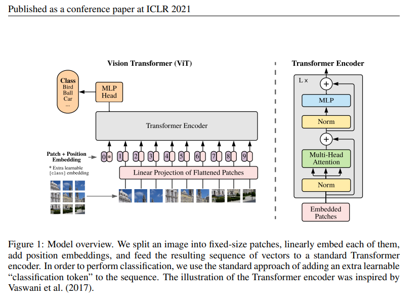

# Implement Vision Transformer Step by Step from Scratch

## Image preprocess

process the image to 224.224

we set patchsize = 16, we have 14x14 patchs

## Reference

https://github.com/hila-chefer/RobustViT

https://debuggercafe.com/fine-tuning-vision-transformer/
